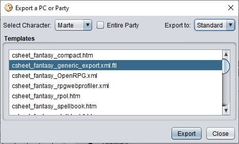

# d8night-tabletop

***d8night-tabletop*** is a web app, developed with *Angular 11* and that uses *Firebase*,
that you can use to store your character sheets created with the [PCGen application](http://pcgen.org/).

* [Which file can be used in d8night-tabletop as sheet](#Which-file-can-be-used-in-d8night-tabletop-as-sheet)
* [How to use this repo](#how-to-use-this-repo)
* [Development server](#development-server)
* [Build](#build)

## Which file can be used in d8night-tabletop as sheet

To use this application, a sheet created with PCGen in needed. Specifically, it's needed the
`csheet_fantasy_generic_export.xml.ftl` XML export (see in the picture below).

## How to use this repo

Clone this repo by using the command `git clone https://github.com/Ic4r0/d8night_tabletop.git`.
Then put your [Firebase configuration](https://firebase.google.com/docs/web/setup) in the
[environment](/src/environments/environment.ts) file.

## Development server

Run `ng serve` for a dev server. Navigate to `http://localhost:4200/`. The app will automatically
reload if you change any of the source files.

*Remember to use the command `npm i` before the first time you use the `ng serve` command.*

## Build

Run `ng build` to build the project. The build artifacts will be stored in the `dist/` directory.
Use the `--prod` flag for a production build.
